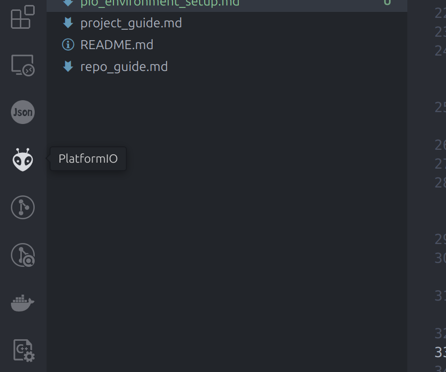
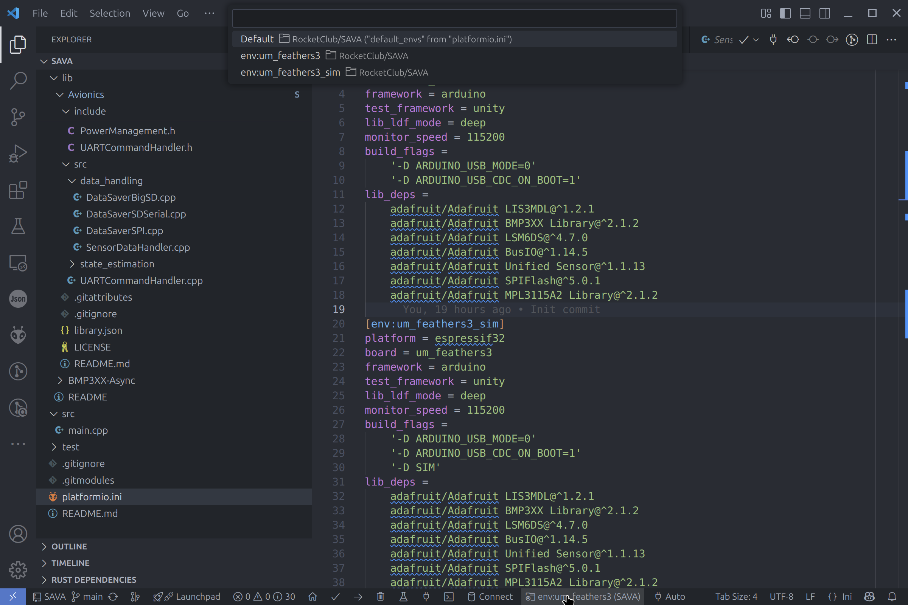
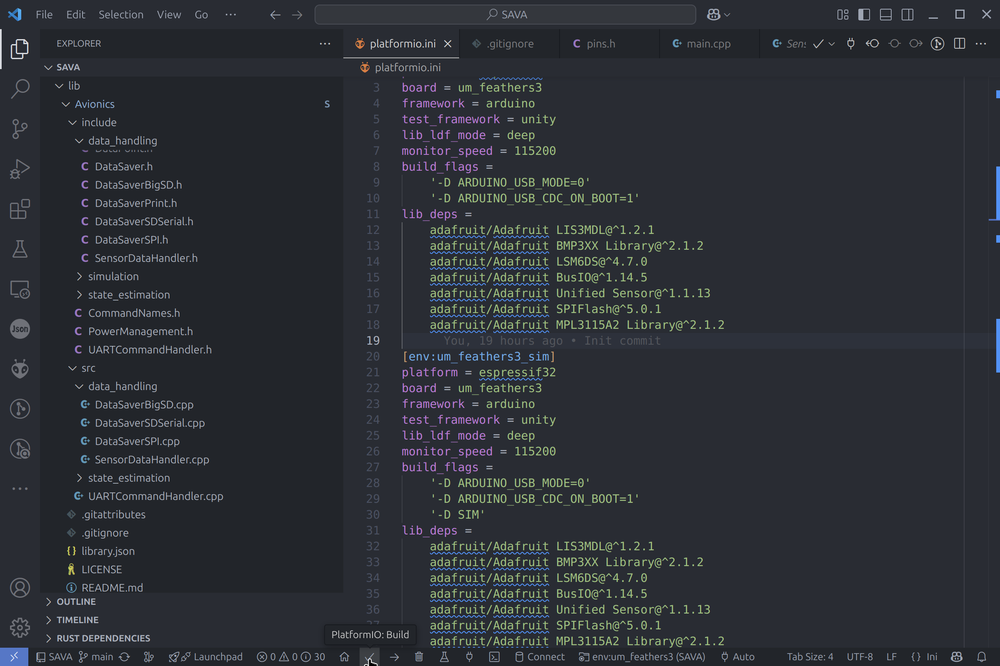
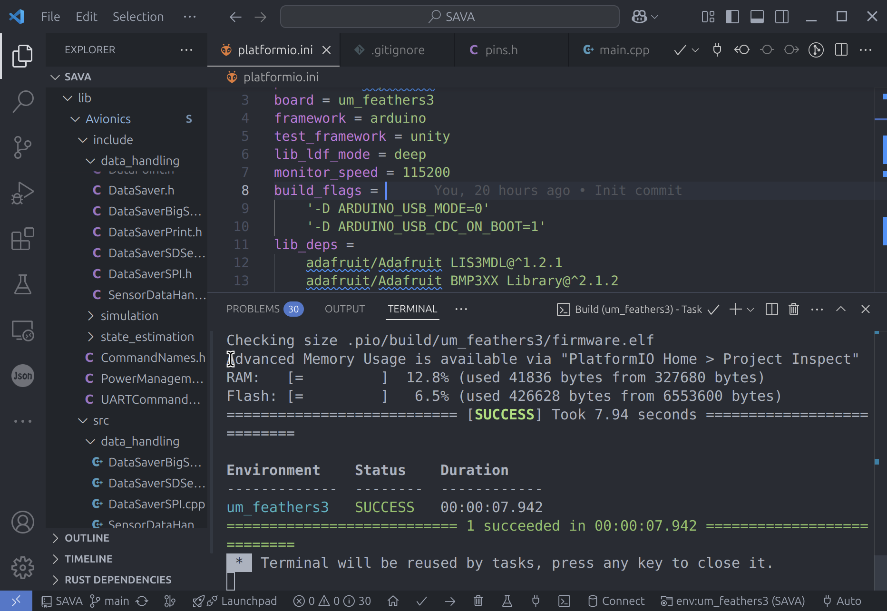
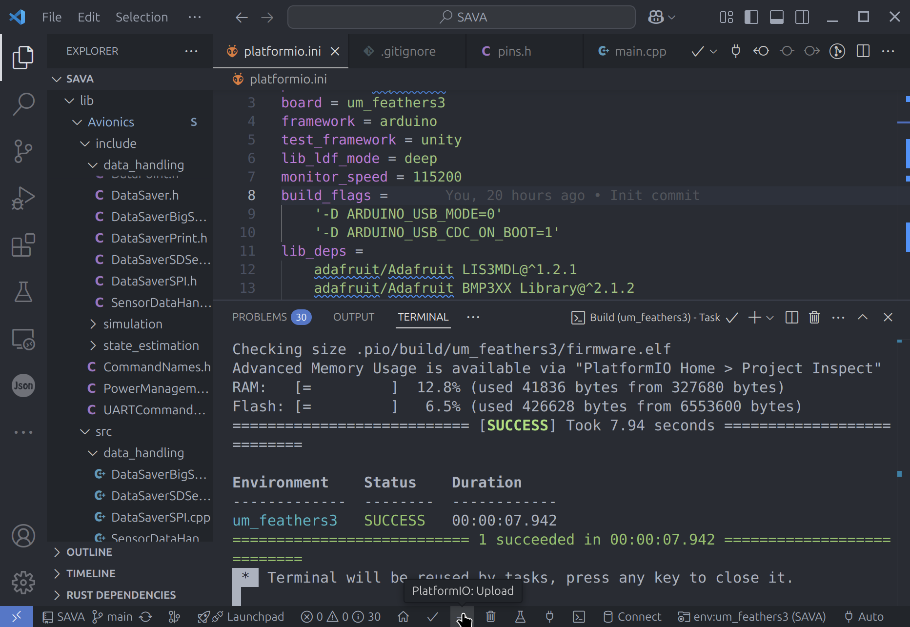
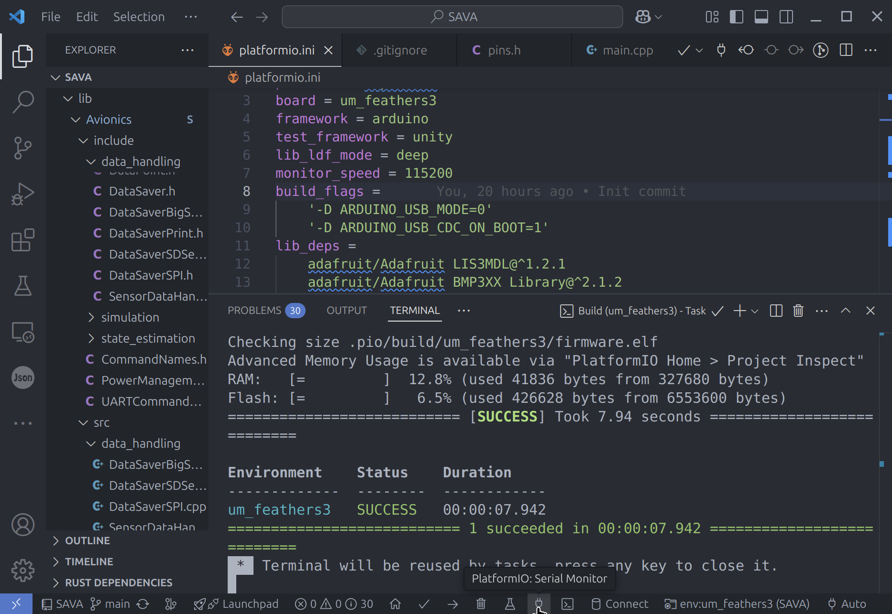

# PlatformIO (PIO) Environment Setup

This guide outlines the steps for setting up PlatformIO (PIO) environment for flashing any of the CURE flight computers, including MARTHA, Active-Aero, and SAVA.

## Table of Contents

* [PlatformIO (PIO) Environment Setup](#platformio-pio-environment-setup)

  * [Prerequisites](#prerequisites)

    * [1. VSCode Installation](#1-vscode-installation)
    * [2. Git Installation](#2-git-installation)
    * [3. Build Tools Installation (Windows Only)](#3-build-tools-installation-windows-only)
    * [4. PlatformIO Installation](#4-platformio-installation)
  * [Building and Flashing Firmware](#building-and-flashing-firmware)

    * [1. Clone the Repository](#1-clone-the-repository)
    * [2. Open the Project in VSCode](#2-open-the-project-in-vscode)
    * [3. Initializing the Submodules](#3-initializing-the-submodules)
    * [4. Selecting the Environment](#4-selecting-the-environment)
    * [5. Building the Project](#5-building-the-project)
    * [6. Flashing the Firmware](#6-flashing-the-firmware)
    * [7. Serial Monitor](#7-serial-monitor)
  * [Build Troubleshooting](#build-troubleshooting)

    * [1. Fatal Error when Fetching Submodules](#1-fatal-error-when-fetching-submodules)
    * [2. Please specify `upload_port`...](#2-please-specify-upload_port)


## Prerequisites

### 1. "VSCode" Installation
- Download and install Visual Studio Code (VSCode) from the official website: [VSCode Download](https://code.visualstudio.com/Download).

### 2. "Git" Installation
- Download and install Git from the official website: [Git Download](https://git-scm.com/downloads).
- We use Git for our version control system, and it is essential for managing our code repositories.
- After installation, you can verify that Git is installed correctly by running the following command in your terminal:
```bash
git --version
```

### 3. "Build Tools" Installation (Windows Only)
- If you are using windows and have not installed the build tools for C++ such as `gcc` or `g++`, you can do so by following VSCode's instructions for Windows users. More specifically, follow their example of installing C++ build tools using MinGW-x64 via MSYS2: https://code.visualstudio.com/docs/languages/cpp#_example-install-mingwx64-on-windows.
- After that is complete you should be able to run the following command in your terminal:
```bash
gcc --version
```
- If you see a version number, then you have successfully installed the build tools. If not, please refer to the VSCode documentation for troubleshooting.
- We need these build tools to compile the code for our flight computers. (Their firmware is written in C++.)

### 4. "PlatformIO" Installation
- Open VSCode and go to the Extensions view by clicking on the Extensions icon in the Activity Bar on the side of the window or by pressing `Ctrl+Shift+X`.
- Search for "PlatformIO IDE" in the Extensions Marketplace.
- Click on the "Install" button to install the PlatformIO IDE extension.
- After installation, you should see the PlatformIO icon in the Activity Bar on the side of the window.




## Building and Flashing Firmware

### 1. Clone the Repository
- First, we need to grab the code off of GitHub into a local folder.
- If you don't already have a rocketry folder, create one.
```bash
mkdir ~/rocketry
```
- Then, navigate to that folder:
```bash
cd ~/rocketry
```
- Now, clone the repository you want to work with.
```bash
# Native
git clone https://github.com/CURocketEngineering/Native.git

# MARTHA 1.3
git clone https://github.com/CURocketEngineering/MARTHA-1.3.git

# Active-Aero
git clone https://github.com/CURocketEngineering/Active-Aero.git

# SAVA
git clone https://github.com/CURocketEngineering/SAVA.git
```

- You can find these repositories in the [CURE GitHub organization](https://github.com/CURocketEngineering)
- Just click on a repo and then click the green "Code" button to copy the HTTPS URL.

### 2. Open the Project in VSCode
- Open VSCode and select "File" > "Open Folder..."
- Navigate to the folder where you cloned the repository and select it.
- E.g. for Native you would select `~/rocketry/Native`.
- This will open the project in VSCode, and you should see the project files in the Explorer view on the left side of the window.

### 3. Initializing the Submodules
- In our projects, we use GitHub submodules to include the Avionics repo and other libraries.
- They aren't automatically cloned when you clone the repo, so we need to initialize them.
- Open a terminal in VSCode by selecting "Terminal" > "New Terminal" from the menu.
- In the terminal, run the following command:
```bash
git submodule init 
git submodule update 
```
- You should see the `Avionics` folder in the `lib` directory of the project appear. 

### 4. Selecting the Environment
- In PlatformIO, you can have several different environments for the same project.
- Some environments are for different boards or for doing simulations. e.g. `env: feathers3 (SAVA)`
- At the bottom of the VSCode window, you should see a status bar with the current environment selected.
- Click on the environment name to open the environment selection menu.
- Select the environment you want to use from the menu that appears at the top. 




### 5. Building the Project

- To build the project, click on the "Build" button in the PlatformIO sidebar (the checkmark icon).



- If everything is set up correctly, you'll see a message indicating that the build was successful in the terminal output.
- If you see any errors, refer to the troubleshooting section below. 



### 6. Flashing the Firmware
- To flash the firmware to the flight computer, connect the flight computer to your computer using a USB cable.
- If it's a flight computer without a built-in programmer, such as MARTHA, you will need to use a programmer like the ST-Link. 
- Make sure the flight computer is powered on and connected to your computer.
- In the PlatformIO sidebar, click on the "Upload" button (the arrow icon) to upload the firmware to the flight computer.



- You should see a message indicating that the upload was successful in the terminal output.
- If you see any errors, refer to the troubleshooting section below.

### 7. Serial Monitor
- To view the output from the flight computer, you can use the Serial Monitor in PlatformIO.
- Click on the "Serial Monitor" button (the plug icon) in the PlatformIO sidebar.




## Build Troubleshooting

Below is a list of errors or common issues when building the project and how to fix them.

### 1. Fatal Error when Fetching Submodules

```
fatal: remote error: upload-pack: not our ref 1b3092a245736aec45eaf2d63c33f38546fa82f6
fatal: Fetched in submodule path 'lib/Avionics', but it did not contain 1b3092a245736aec45eaf2d63c33f38546fa82f6. Direct fetching of that commit failed.
```

This error means that the Git reference for the submodule is not available. This usually happens if the flight computer repo is updated, but the submodule hasn't been pushed to the remote repository yet. To fix this, ask the person who has last updated the flight computer repo to push their submodule changes to the remote repository.

How to update the submodule:
```bash
cd ~/rocketry/<flight computer repo>
cd lib/<submodule>
git push origin <branch>
```

### 2. Please specify `upload_port`...
```
Error: Please specify `upload_port` for environment or use global `--upload-port` option.
```
This error means that PlatformIO doesn't know which port to use to upload the firmware. 

- Make sure your USB cable supports data transfer and is not just a power cable. (Many of the cables in Cook are just power cables.)
- Make sure the flight computer is powered on and connected to your computer.
- If it's a FeatherS3, make sure it's in the programmable boot mode. (Hold the boot button and then tap the reset button.)

## Next Steps

### Native
To further verify that PlatformIO is configured properly, we can run local
unit tests using Native. 
Follow the instructions in the [Native README](https://github.com/CURocketEngineering/Native/blob/main/README.md). 
There is some overlap with this guide, so skip the parts that you've already completed. 