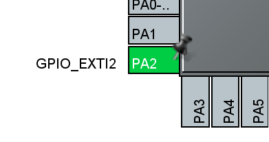
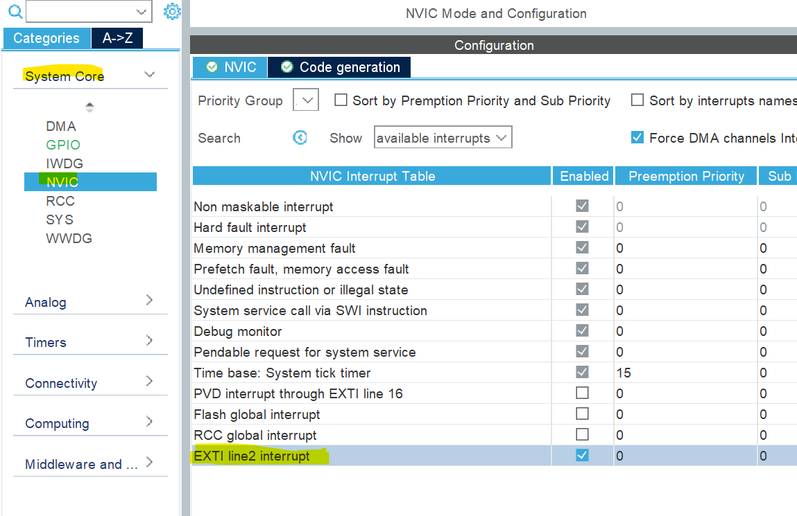

### Interrupts 
With interrupts, the time spent asking the sensor if it is ready is completely avoided. Instead, the sensor will make
a specific pin go high when the data is ready. This pin will be connected to one of the GPIO pins on the microcontroller.
When that pin goes high, a system interrupt is triggered, causing the current code to stop executing and jump to the 
interrupt handler. The interrupt handler will then read the data from the sensor and store it in a buffer. 
After the handler finishes executing, the main code will resume execution where it left off.
The main code can then read the data from the buffer whenever it wants.

Depending on the specific sensor, reading the data causes the interrupt pin to go low again such that an interrupt
can be triggered again. For example, the interrupt handler could simply set a variable flagging that the data is ready 
to true without reading the data. This prevents the interrupt from being triggered constantly which would prevent the main code
from actually doing anything. The main code can then read the data from the sensor and set the flag to false at its 
leisure.

### Polling
Interrupts are used to avoid polling the sensors. Typically, to poll the sensor, one would need to send a message over 
i2c to the sensor, wait for the sensor to respond with a message about the data being ready or not, and then request the
actual data if it is ready. This is a lot of overhead and can be avoided by using interrupts.

### Interrupts on the STM32

#### Configuring the pin
As far as I can tell, any GPIO pin can be configured to trigger an interrupt.
I've set the PA2 pin as an interrupt pin by setting it to GPIO_EXTI2 in the ioc file.



#### Setting up NVIC

The next step is to enable the interrupt in the NVIC. The NVIC is the Nested Vectored Interrupt Controller. It is a
hardware block that handles all interrupts. It is responsible for determining which interrupt to handle when multiple
interrupts are triggered at the same time. It also handles the priority of interrupts. For example, if two interrupts
are triggered at the same time, the NVIC will handle the interrupt with the higher priority first. The NVIC is also
responsible for enabling and disabling interrupts.

I enabled the interrupt for EXTI line 2 by going to system core | NVIC and checking the box next to EXTI2.


Upon generating the code, you should notice an interrupt handler function in the stm32f1xx_it.c file. 
This is what I got after generating the code:

```c
/**
  * @brief This function handles EXTI line2 interrupt.
  */
void EXTI2_IRQHandler(void)
{
  /* USER CODE BEGIN EXTI2_IRQn 0 */

  /* USER CODE END EXTI2_IRQn 0 */
  HAL_GPIO_EXTI_IRQHandler(GPIO_PIN_2);
  /* USER CODE BEGIN EXTI2_IRQn 1 */

  /* USER CODE END EXTI2_IRQn 1 */
}
```

#### Handling the interrupt

The last step is to actually handle the interrupt. This is done in the interrupt handler function.

For example, you can set a flag to true. I set the `alt_data_rdy` flag to true in the interrupt handler function.
This doesn't actually read data from the sensor, so the sensor will continue the interrupt pin high until I do read
from it. This prevents the interrupt from being triggered constantly.
    
```c
void EXTI2_IRQHandler(void)
{
  /* USER CODE BEGIN EXTI2_IRQn 0 */
  alt_data_rdy = 1;  // FLAG
  /* USER CODE END EXTI2_IRQn 0 */
  HAL_GPIO_EXTI_IRQHandler(GPIO_PIN_2);
  /* USER CODE BEGIN EXTI2_IRQn 1 */

  /* USER CODE END EXTI2_IRQn 1 */
}
```

A new interrupt for this pin will not be triggered until I actually read the data which I know
I can do because the flag is high. I can then set the flag to false after reading the data.

I have something like this in my `main.c`

```
if (alt_data_rdy){
		  alt_data_rdy = 0;
		  // This will casue the interrupt pin to go low again
		  // So a new interrupt can be triggered
		  int alt = MPL3115A2_int_ReadAltitude();
}
```