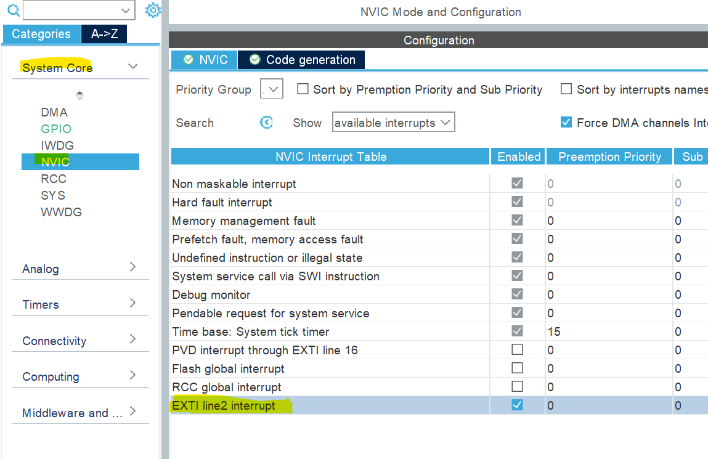

## Table of Contents
1. [Installation](#installation)
2. [Creating a new project](#creating-a-new-project)
3. [Configuring the ioc](#configuring-the-ioc)
4. [Adding code](#adding-code)
5. [Debugging](#debugging)
6. [I2C](#i2c)
7. [Writing to the SD card](#writing-to-the-sd-card)
8. [UART](#uart)
9. [Videos](#videos)

## Installation
Install stm32CubeIDE from [here](https://www.st.com/en/development-tools/stm32cubeide.html) and follow the instructions.
This IDE is based on eclipse and is the official IDE for STM32 microcontrollers. 
It has debugging and ST-Link support built in. It can also generate code for HAL drivers based
on the microcontroller you are using.

## Creating a new project
1. Open STM32CubeIDE
2. Click on File -> New -> STM32 Project
3. Select the microcontroller you are using. For example, MARTHA uses a STM32F103C8T6
4. Give a project name, leave the rest of the settings as default and click finish

## Configuring the ioc
1. Open the .ioc file in the project explorer
2. In the IOC editor, you can change clock settings, pin settings, and enable peripherals
3. Enable SPI, UART, and I2C2 for MARTHA.
   - SPI is used for the SD card, UART is used for printing to the console, and I2C2 is used for the IMU and altimeter.
4. Inside of system core | sys, set the debug to serial wire, so we can use
the ST-Link's swd pins for debugging. 
5. Save the ioc file to generate the code for the peripherals you enabled.

## Adding code
1. To start messing around, try adding code to the main.c file in the Core/Src folder.

## Debugging
1. To debug, click on the debug button in the toolbar.
2. The first time you click this, you will be prompted to select a debug configuration.
3. Within the configuration window go inside the debugger tab and enable Serial Wire Viewer.
4. Click debug, and you should be able to step through code and see the values of variables.
5. You can also add breakpoints by double-clicking on the left side of the code editor.

## I2C
Not explored fully yet

## Writing to the SD card
Not explored fully yet

## UART
Not explored fully yet

## Interrupts

### Polling
Interrupts are used to avoid polling the sensors. Typically, to poll the sensor, one would need to send a message over 
i2c to the sensor, wait for the sensor to respond with a message about the data being ready or not, and then request the
actual data if it is ready. This is a lot of overhead and can be avoided by using interrupts.

### Interrupts 
With interrupts, the time spent asking the sensor if it is ready is completely avoided. Instead, the sensor will make
a specific pin go high when the data is ready. This pin will be connected to one of the GPIO pins on the microcontroller.
When that pin goes high, a system interrupt is triggered, causing the current code to stop executing and jump to the 
interrupt handler. The interrupt handler will then read the data from the sensor and store it in a buffer. 
After the handler finishes executing, the main code will resume execution where it left off.
The main code can then read the data from the buffer whenever it wants.

Depending on the specific sensor, reading the data causes the interrupt pin to go low again such that an interrupt
can be triggered again. For example, the interrupt handler could simply set a variable flagging that the data is ready 
to true without reading the data. This prevents the interrupt from being triggered constantly which would prevent the main code
from actually doing anything. The main code can then read the data from the sensor and set the flag to false at its 
leisure.

### Interrupts on the STM32

#### Configuring the pin
As far as I can tell, any GPIO pin can be configured to trigger an interrupt.
I've set the PA2 pin as an interrupt pin by setting it to GPIO_EXTI2 in the ioc file.


#### Setting up NVIC

The next step is to enable the interrupt in the NVIC. The NVIC is the Nested Vectored Interrupt Controller. It is a
hardware block that handles all interrupts. It is responsible for determining which interrupt to handle when multiple
interrupts are triggered at the same time. It also handles the priority of interrupts. For example, if two interrupts
are triggered at the same time, the NVIC will handle the interrupt with the higher priority first. The NVIC is also
responsible for enabling and disabling interrupts.

I enabled the interrupt for EXTI line 2 by going to system core | NVIC and checking the box next to EXTI2.


Upon generating the code, you should notice an interrupt handler function in the stm32f1xx_it.c file. 
This is what I got after generating the code:

```c
/**
  * @brief This function handles EXTI line2 interrupt.
  */
void EXTI2_IRQHandler(void)
{
  /* USER CODE BEGIN EXTI2_IRQn 0 */

  /* USER CODE END EXTI2_IRQn 0 */
  HAL_GPIO_EXTI_IRQHandler(GPIO_PIN_2);
  /* USER CODE BEGIN EXTI2_IRQn 1 */

  /* USER CODE END EXTI2_IRQn 1 */
}
```

## Videos
Here are some helpful videos to help you get started:
- [Programming in C Quick](https://www.youtube.com/watch?v=3lQEunpmtRA)
- [Programming in C Long](https://www.youtube.com/watch?v=KJgsSFOSQv0)
- [STM32CubeIDE Tutorial](https://www.youtube.com/watch?v=dnfuNT1dPiM)

I think it goes without saying, that you do not have to watch the entirety of these videos, the only one I reccomend watching entirely through is the Programming In C Quick. Ideally you should skim through the longer ones and watch the parts your confused about; but the best way to tackle this is honestly to just start coding and google things as you go and try and make a quick little hello world or command line calculator in C to get a handle on things. Remember practice is the best way to learn so don't spend too long listening to the videos.